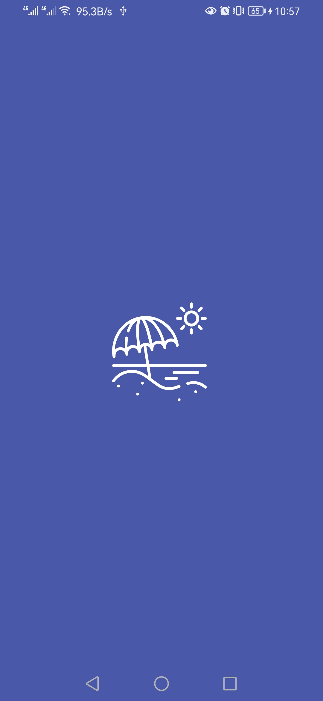
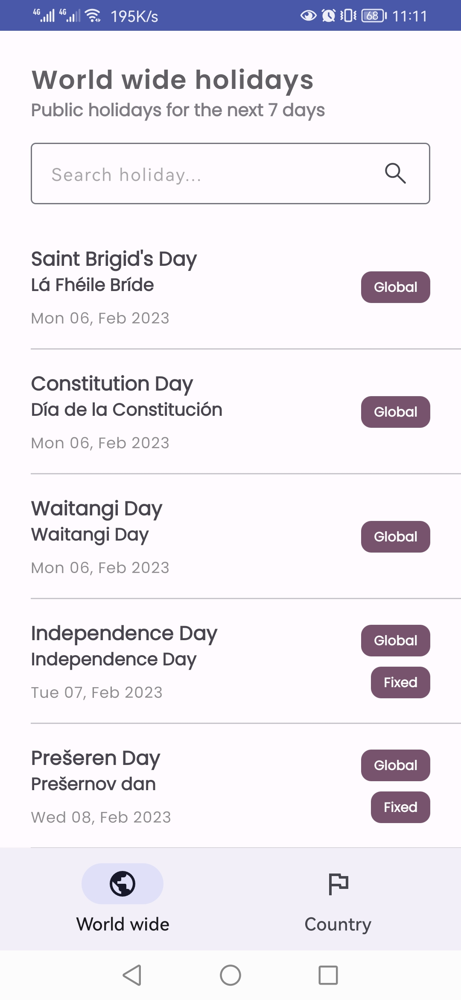
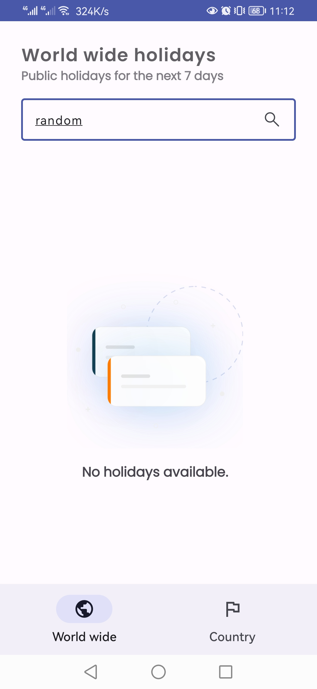
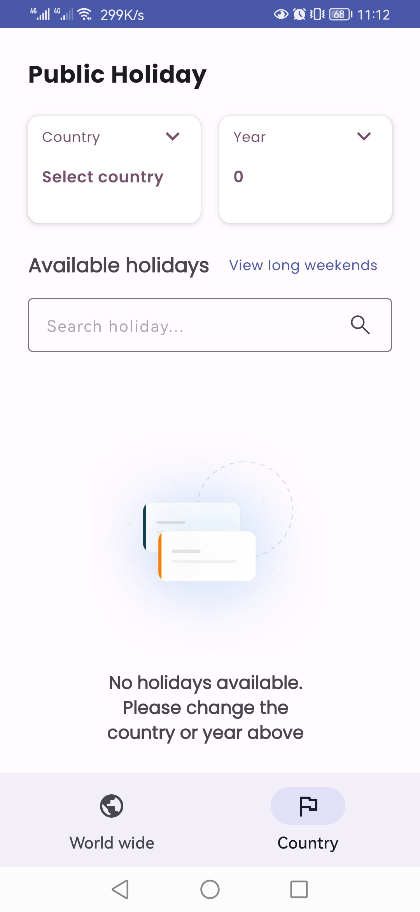
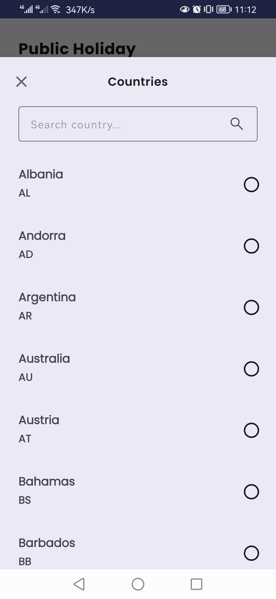
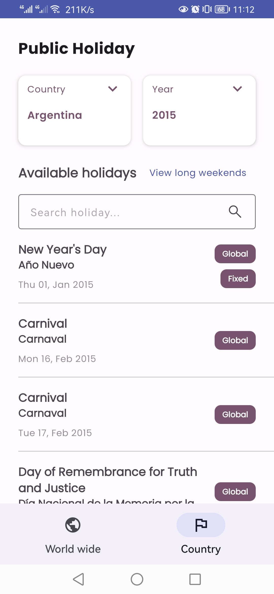
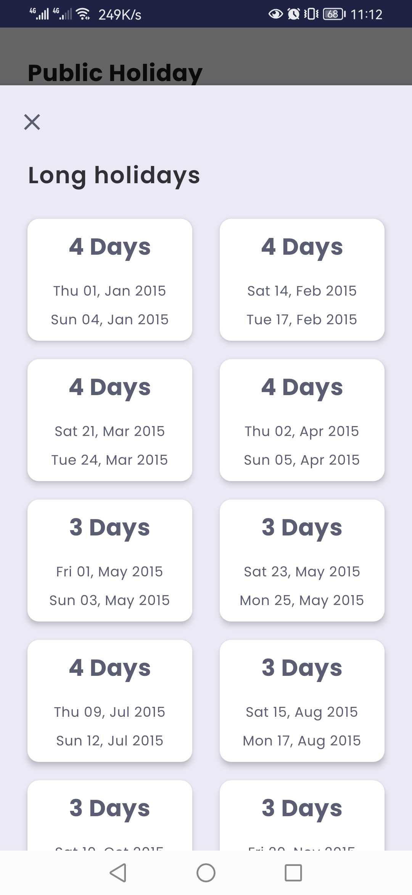
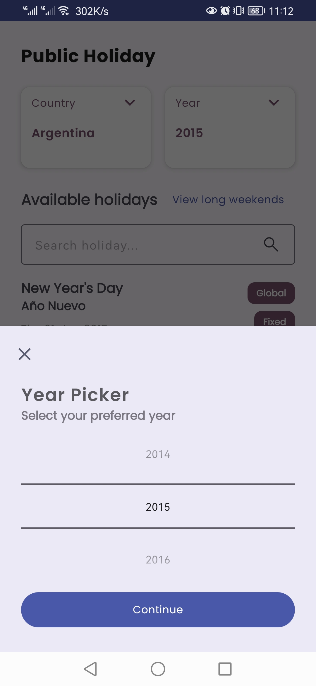

# Public Holiday

[](https://github.com/kelvinkioko/Public-Holiday/actions)
[](http://kotlinlang.org/)
[](http://www.apache.org/licenses/LICENSE-2.0)

**Public Holiday** *Create an app that uses the Public holidays API at https://date.nager.at/Api to display various pieces of data found there. The app's UI should showcase your ability to work with lists, and UI events and any Kotlin features you would like to showcase.*

<p align="center">
    <a href="#-walk-through">GIF walk through</a> •
    <a href="#-screenshots">Screenshots</a> •
    <a href="#-built-instructions">Built Instructions</a> •
    <a href="#-features">Features</a> •
    <a href="#-documentation">Documentation</a> •
    <a href="#-automation">Automation</a>
</p>

## Walk through
<p align="center">
    
</p>

## Screenshots
<p align="center">
    
    
    
</p>

<p align="center">
    
    
    
</p>

<p align="center">
    
    
</p>

## Built Instructions 🛠
1. Download Xcode
    Public holidays was built using Android Studio Electric Eel | 2022.1.1 Patch 1 | Build #AI-221.6008.13.2211.9514443, built on January 21, 2023
    Gradle version 7.5
2. Clone project in the folder of your preference
    ```bash
    git clone https://github.com/kelvinkioko/Public-Holiday.git
    ```
3. Once cloning is complete, the project will download the necessary dependencies and it will be ready to run.

## Features 🛠
- Uses [date.nager.at](https://date.nager.at/Api) to fetch holiday and country data
- Get upcoming world wide public holidays
- Get country based public holidays based on country code and specific year
- Get long weekends based on country code and specific year
- Offline mode - Application caches holidays and countries locally and can show them even when the application is offline 
- Ability to filter holidays and countries locally

## Documentation 🛠
- [Architecture]()
  Model View ViewModel. This separates our views from business logic. It makes the different code component testable, loosely coupled and maintainable.
- [Kotlin](https://kotlinlang.org/)
  The project is native android and has been developed with 95.9% kotlin
- [Coroutines](https://kotlinlang.org/docs/reference/coroutines-overview.html)
  Coroutines were used to allow asynchronous request with the ability to manage the different threads available
- [Flow](https://developer.android.com/kotlin/flow/stateflow-and-sharedflow)
  Used stateFlow to facilitate state updated from the ViewModel and state observation and consumption on the fragment side
- [Android Architecture Components](https://developer.android.com/topic/libraries/architecture) - Collection of libraries that help you design robust, testable, and maintainable apps.
    - [ViewModel](https://developer.android.com/topic/libraries/architecture/viewmodel) 
      View models have been used to stores UI-related data that isn't destroyed on UI changes and manage communication with the data layer through the domain
    - [ViewBinding](https://developer.android.com/topic/libraries/view-binding)
      Generates a binding class for each XML layout file present in that module and allows you to more easily write code that interacts with views.
    - [Room](https://developer.android.com/topic/libraries/architecture/room)
      SQLite object mapping library that allows us to do local caching, reduce number of API calls in future and improve overall data fetch speeds for duplicate requests
- [Dependency Injection](https://developer.android.com/training/dependency-injection) -
    Public Holiday uses [Hilt-Dagger](https://dagger.dev/hilt/) to manage its dependencies.
- [Material Components for Android](https://github.com/material-components/material-components-android) - Modular and customizable Material Design UI components for Android.
- [Coding Guidelines]()
   - [Coding Style](https://developer.android.com/kotlin/style-guide)
     In the development process, there was a high emphasis on following the standard recommended coding structure guideline, naming conventions and resource management (Styling, themes, custom fonts and strings)
   - [ktlint](https://github.com/pinterest/ktlint)
     ktlint aims to enforce the official Kotlin coding conventions and Android Kotlin Style Guide
   - [lint](https://developer.android.com/studio/write/lint)
     Checks your Android project source files for potential bugs and optimization improvements for correctness, security, performance, usability, accessibility, and internationalization
- [Testing]()
   - [UI Testing]()
     In [androidTest](app/src/androidTest/java/com/holiday/) you'll find a suite of UI tests that test different aspects of the fragments, and local cache
   - [Unit Testing]()
     In [test](app/src/test/java/com/holiday/) you'll find a suite of unit tests that tests multiple sections of the app such as ViewModels and data class mappers


## Automation
### Github Actions
The public holiday project uses [Github Actions](https://github.com/kelvinkioko/Public-Holiday/actions) for continuous integration.

**Contributed By:** [Kelvin Kioko](https://github.com/kelvinkioko/)

## Contact
If you need any help, you can connect with me.
